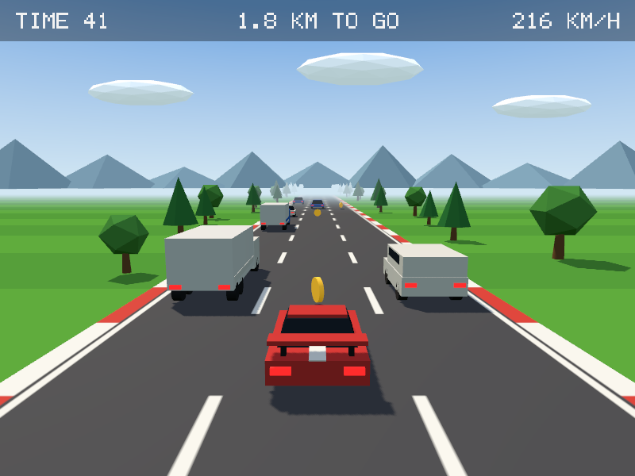
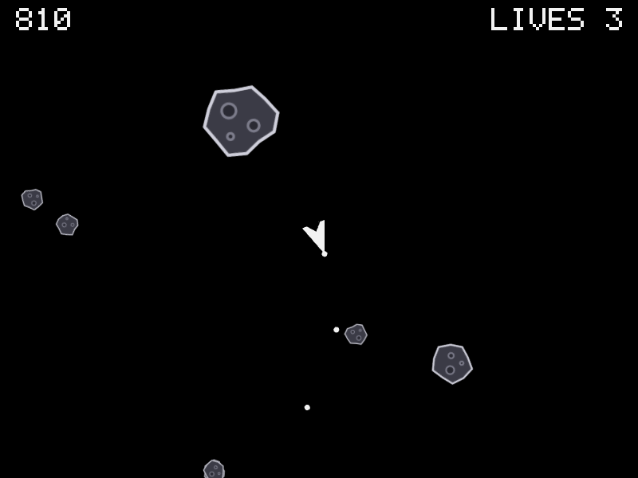
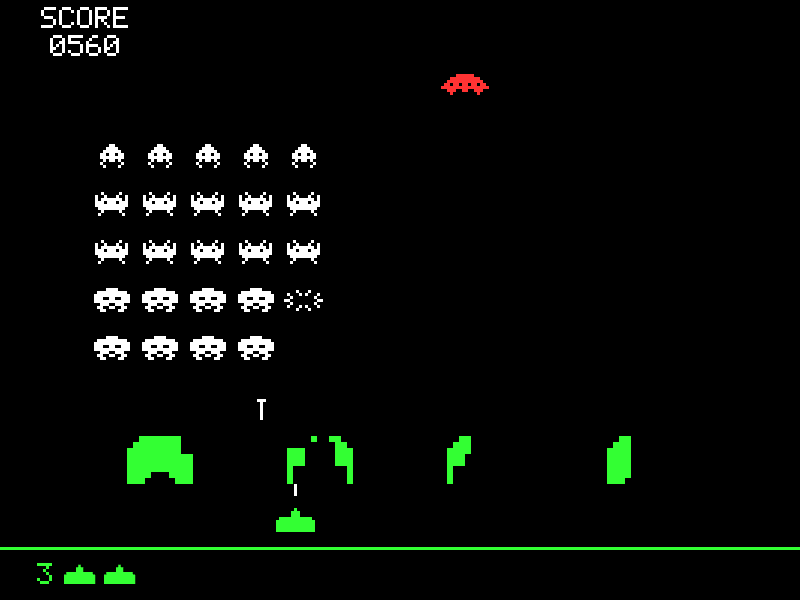
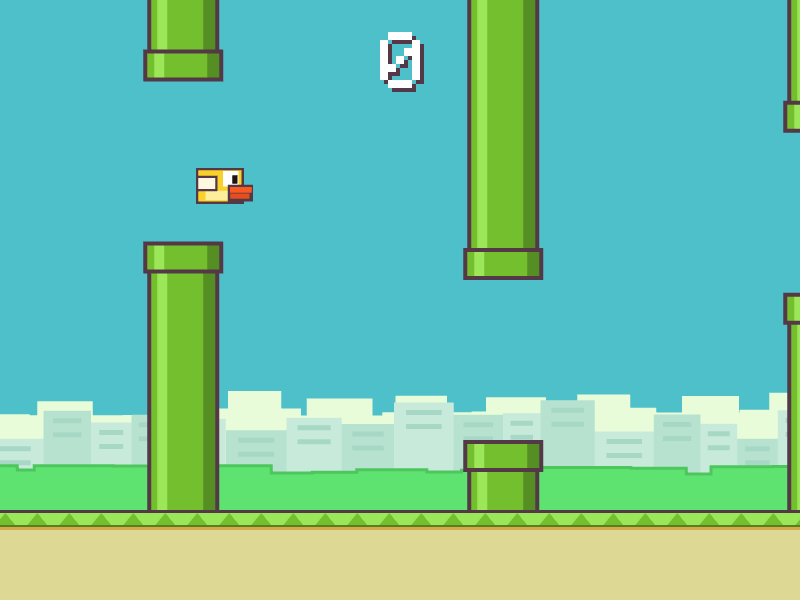
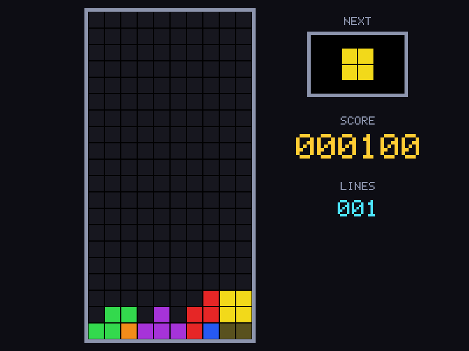

<div align="center">

# ThreeJam

*A 2D game engine on Three.js where your coding agent proves what its game does*

[](https://www.npmjs.com/package/threejam)
[](https://nodejs.org)
[](https://www.typescriptlang.org)
[](https://threejs.org)
[](LICENSE)

[Play the examples](https://aksheyd.github.io/threejam/) • [Features](#features) • [Quick start](#quick-start) • [Docs](docs/README.md)

<a href="https://aksheyd.github.io/threejam/racer.html"></a>
<a href="https://aksheyd.github.io/threejam/asteroids.html"></a>
<a href="https://aksheyd.github.io/threejam/invaders.html"></a>
<a href="https://aksheyd.github.io/threejam/flappy.html"></a>
<a href="https://aksheyd.github.io/threejam/tetris.html"></a>

</div>

ThreeJam is a 2D game engine on [Three.js](https://threejs.org) made for coding agents, built around one promise: the agent can prove what its game does. The engine owns the loop, time, input, and random numbers, so the same files, flags, and seed always give the same run, in `sim` and in the browser. An agent checks its game from exact numbers and frames instead of watching a window:

```console
$ npx threejam sim games/catch --ticks 120 --press Space@1 --hold Right@2-40 --filter-output log
log[1]{tick,text}:
  98,"caught, score 1"
cta:
  description: "Suggested command:"
  commands[1]{command,description}:
    threejam shot games/catch --at 120 --press Space@1 --hold Right@2-40,See this tick as a PNG
```

The mistakes agents make most in games are stopped where they happen:

- A made-up API, an undeclared field, or a wrong type fails `check` with its file and line.
- An image or sound the folder lacks fails as soon as the game uses it, naming the file.
- The engine owns the game loop, so there's none to wire up wrong.
- In `check`, `sim`, and `shot`, code that never returns stops with `TIMEOUT`, saying where it was stuck.
- Reading the clock or `Math.random` fails, and the machine's locale and time zone never reach game code, so they can't change a run.

One set of command definitions gives you a CLI, MCP tools, agent skills, and an LLM manifest.

> [!NOTE]
> ThreeJam is a prototype. Entities can't be added during a run, though a group works as a pool of them; see the [full list](AGENTS.md#not-in-threejam-yet) of what's missing.

## Features

- **Games are plain TypeScript.** `game.ts` declares entities as data and changes them in `update(world, ctx)`, with typed lists, optional values, entities made of parts that move and turn together, and groups that work as pools with `spawn`. An optional `view.ts` adds decoration with raw Three.js that the game logic never sees, or draws the whole game in 3D, as the Racer example does.
- **Images, sound, and the mouse.** Shapes turn and can show PNG, JPEG, WebP, GIF, or SVG files, or pixel art written as text, games play built-in synthesized sounds or their own sound files, and the mouse buttons work like keys next to a pointer in world units.
- **Runs repeat exactly.** The engine owns the clock, input, and seeded random numbers, and swaps `Math.sin` and similar functions for portable versions, so `sim` and the page in the browser reach exactly the same state and play the same sounds.
- **Tests without a window.** `sim` runs exact ticks with scripted keys, mouse, and pointer or a bot, and prints the state and the sounds played, and `simulate()` does the same inside a test.
- **Frames on demand.** `shot` renders the page players see in headless Chrome, at the ticks you pick.
- **One file to share.** `export` writes a game as a single HTML file, images and sounds included, that plays offline, and on a phone shows a key next to the game for each key it reads; `--script` adds the widget a game jam requires. The [example games](https://aksheyd.github.io/threejam/) are online as these files, to play in the browser.
- **Mistakes point at the line.** `check` type-checks the game and runs its first tick, and bad assignments, like an undeclared field, `NaN`, an unknown color, an image the folder lacks, or an item that doesn't fit its list, fail where they happen with the file, line, and tick.
- **One definition, every interface.** The CLI, the MCP tools, the generated skills, and `--llms` all come from [`src/cli.ts`](src/cli.ts), built with [incur](https://github.com/wevm/incur).

## Quick start

Install ThreeJam in your project, and give your coding agent the skill that teaches it to build and test games with it:

```bash
npm install -D threejam
npx skills add https://github.com/aksheyd/threejam/tree/v0.0.5/skills/threejam
```

Then ask your agent for a game. Starting from an empty folder instead? `npx threejam new my-game` writes a project of its own; see [getting started](docs/getting-started.md).

A skill installed from a tag stays on that version, so after you upgrade ThreeJam, run `npx skills add` again with the new tag.

## Docs

- [Getting started](docs/getting-started.md): what you need, and starting a game yourself
- [Making a game](docs/making-a-game.md): the game of catch `new` writes, from checking it to sharing it as one HTML file
- [Commands](docs/commands.md): every command and flag
- [For coding agents](docs/agents.md): the skill, the MCP tools, and the other forms the commands take
- [Example games](docs/examples.md): Pong, Breakout, Snake, Flappy, Invaders, Tetris, Asteroids, and Racer
- [`AGENTS.md`](AGENTS.md): the full manual, including the known problems
- [`CONTRIBUTING.md`](CONTRIBUTING.md): working on ThreeJam itself, and how releases go
- [`CHANGELOG.md`](CHANGELOG.md): what changed in each release
